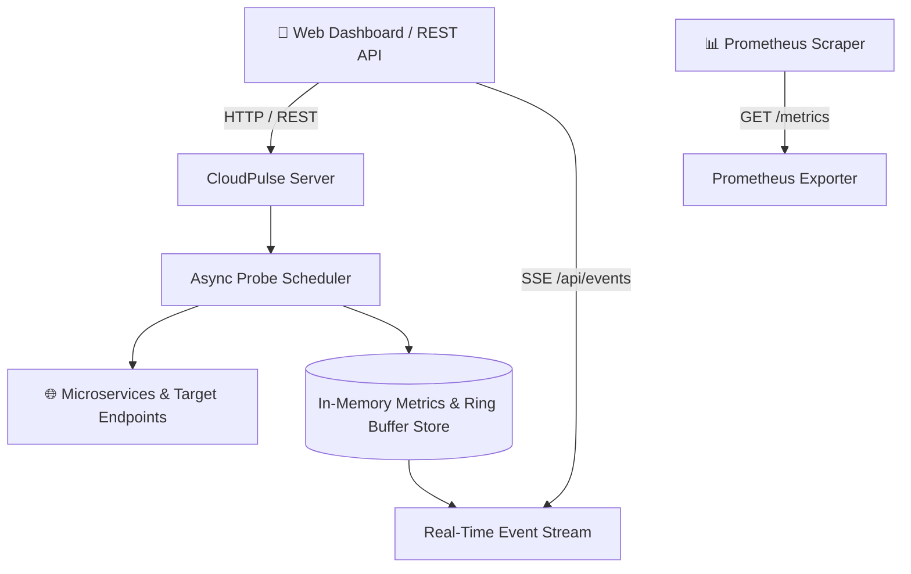

# ⚡ CloudPulse-API
> **Real-Time Microservice Observability, Latency Percentiles & Uptime Monitoring Engine**  
> *Developed autonomously by the 7-Agent SDLC Team for [Ali Nurettin Demir](https://github.com/alinurettin)*

[](https://github.com/alinurettin/CloudPulse-API/actions)
[](https://opensource.org/licenses/MIT)
[](https://nodejs.org/)
[](https://www.docker.com/)

---

## 🌟 Overview

**CloudPulse-API** is a lightweight, zero-dependency microservice health, latency, and uptime monitoring engine built for modern distributed systems and DevOps engineers.

- **Non-blocking Probe Scheduler:** Periodically probes HTTP/HTTPS microservices, APIs, and background workers with configurable intervals and timeouts.
- **Statistical Percentile Latencies:** Computes rolling $p50$, $p95$, and $p99$ response times, uptime percentage, and min/max stats.
- **Native Prometheus Exporter:** Exposes standard OpenMetrics at `GET /metrics` for direct ingestion by Grafana and Prometheus.
- **Real-Time Web Dashboard:** Embedded dark-themed live interface streaming probe updates over Server-Sent Events (SSE).
- **Dynamic Service Management:** Programmatic REST API to register, probe, and decommission microservice targets.
- **Zero External Dependencies:** Built with pure Node.js standard libraries for maximum reliability and zero vulnerability surface.

---

## 🏗️ Architecture



---

## 🚀 Quick Start

### Option 1: Docker Compose (Recommended)
```bash
git clone https://github.com/alinurettin/CloudPulse-API.git
cd CloudPulse-API
docker-compose up -d
```
Open **`http://localhost:3000`** in your browser.

### Option 2: Local Node.js
```bash
git clone https://github.com/alinurettin/CloudPulse-API.git
cd CloudPulse-API
npm start
```

---

## 🔌 REST API Reference

| Method | Endpoint | Description |
| :--- | :--- | :--- |
| `GET` | `/api/health` | System health, engine status, and monitored service counts. |
| `GET` | `/api/services` | Retrieve list of all monitored services with full latency percentiles. |
| `POST` | `/api/services` | Register a new microservice (`{ name, url, intervalMs?, timeoutMs? }`). |
| `DELETE` | `/api/services/:id` | Remove a microservice from active monitoring. |
| `POST` | `/api/services/:id/ping` | Trigger an immediate ad-hoc probe on target endpoint. |
| `GET` | `/api/events` | Real-time Server-Sent Events (SSE) streaming probe updates. |
| `GET` | `/metrics` | Prometheus OpenMetrics formatted text. |

### Register Service Example
```bash
curl -X POST http://localhost:3000/api/services \
  -H "Content-Type: application/json" \
  -d '{"name": "Auth Service", "url": "https://httpbin.org/status/200", "intervalMs": 10000}'
```

### Prometheus Metrics Sample
```text
# HELP cloudpulse_service_up Microservice health status (1 = UP/HEALTHY, 0 = DOWN)
# TYPE cloudpulse_service_up gauge
cloudpulse_service_up{id="srv-01",name="Auth Service",url="https://httpbin.org/status/200"} 1
cloudpulse_latency_seconds{id="srv-01",name="Auth Service",url="https://httpbin.org/status/200"} 0.0420
cloudpulse_latency_p95_seconds{id="srv-01",name="Auth Service",url="https://httpbin.org/status/200"} 0.0650
cloudpulse_uptime_percent{id="srv-01",name="Auth Service",url="https://httpbin.org/status/200"} 100.00
```

---

## 🧪 Automated Testing

```bash
npm test
```
Runs comprehensive test suites covering:
- Statistical percentile calculations ($p50, p95, p99$)
- In-memory ring buffer memory bounding
- REST API endpoint verification & Prometheus formatting

---

## 📁 Project Structure

```text
CloudPulse-API/
├── src/                          # Engine source code
│   ├── index.js                  # Entrypoint & CLI runner
│   ├── server.js                 # HTTP REST router & SSE hub
│   ├── probeEngine.js            # Async network prober
│   ├── store.js                  # In-memory service store
│   ├── stats.js                  # Percentile & uptime math
│   └── prometheus.js             # Prometheus exporter
├── public/                       # Frontend live dashboard
│   ├── index.html                # Dark-themed dashboard UI
│   ├── style.css                 # Responsive styles & latency bars
│   └── app.js                    # SSE client & service manager
├── tests/                        # Automated test suites
│   ├── stats.test.js
│   ├── store.test.js
│   ├── api.test.js
│   └── run_tests.js
├── artifacts/                    # SDLC Documentation
│   ├── RESEARCH_REPORT.md
│   ├── PRD.md
│   ├── ARCHITECTURE.md
│   ├── QA_REPORT.md
│   ├── RELEASE_NOTES.md
│   └── COMMUNICATION_LOG.md
├── Dockerfile                    # Multi-stage production container
├── docker-compose.yml            # Compose service specification
├── package.json
└── README.md
```

---

## 👤 Author & License

- **Author:** Ali Nurettin Demir ([@alinurettin](https://github.com/alinurettin))
- **Autonomous Team:** 7-Agent SDLC Autonomous Software Factory
- **License:** [MIT License](LICENSE)
