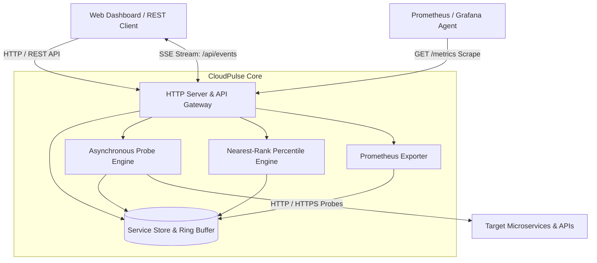

# ⚡ CloudPulse-API v2.0.0

[](https://nodejs.org)
[](#architecture)
[](#mathematical-percentiles)
[-success.svg)](#test-suite)
[](LICENSE)
[](https://github.com/alinurettin)

> **Enterprise Real-Time Microservice Observability, Nearest-Rank Latency Percentile Engine ($p50, p90, p95, p99$), Prometheus Scrape Gateway, and Live SSE Streaming.**

---

## 🇹🇷 Türkçe Açıklama ve Genel Bakış

**CloudPulse-API v2.0.0**, dağıtık bulut mimarileri, mikroservis ekosistemleri ve harici API bağımlılıkları (Stripe, Twilio, Auth0 vb.) için geliştirilmiş, harici bağımlılık barındırmayan (zero-dependency) yüksek performanslı bir sentetik yoklama, SLA gecikme telemetrisi ve Prometheus kazıma (scrape) ağ geçididir.

### Öne Çıkan Yetenekler:
1. **Asenkron Sentetik Yoklama Motoru:** Yapılandırılabilir zaman aşımı (timeout) ve periyotlarla mikroservis uç noktalarını arka planda sürekli denetler.
2. **Nearest-Rank Yüzdelik Matematiği & Standart Sapma:** Basit ortalamaların kuyruk gecikmelerini gizleme sorununu çözer; $p50$, $p90$, $p95$, $p99$ ve standart sapma $\sigma$ metriklerini kesin matematiksel rütbe algoritmasıyla hesaplar.
3. **Prometheus Standart Kazıma Ağ Geçidi:** `/metrics` uç noktasında RFC uyumlu gauge metrikleri (servis durumu, son gecikme, yüzdelikler, çalışma süresi) sunar.
4. **Gerçek Zamanlı SSE Yayın Akışı:** Yoklama sonuçları ve servis durum değişiklikleri istemci kontrol paneline anında aktarılır.
5. **Siber Karanlık Mod Operasyon Paneli:** `public/` dizininde servis kartları, canlı gecikme grafikleri ve anlık ping butonları sunan interaktif stüdyo.
6. **%100 Gerçek Soket Testleri:** Mock kullanılmadan, dinamik işletim sistemi HTTP soketleri üzerinden çalışan 25 kapsamlı doğrulama testi.

---

## 🏛️ System Architecture



---

## 📐 Mathematical Percentiles & SLA Metrics

### 1. Nearest-Rank Percentile Latency
For a sorted latency sample $X = [x_0, x_1, \dots, x_{N-1}]$, the rank for percentile $P \in (0, 100]$ is computed deterministically:

$$\text{Rank}(P) = \left\lceil \frac{P}{100} \times N \right\rceil - 1$$

$$V_P = X\left[\max\left(0, \min\left(N - 1, \text{Rank}(P)\right)\right)\right]$$

### 2. Standard Deviation & Jitter
$$\mu = \frac{1}{N} \sum_{i=0}^{N-1} x_i, \quad \sigma = \sqrt{\frac{1}{N} \sum_{i=0}^{N-1} (x_i - \mu)^2}$$

### 3. Availability SLA
$$\text{Uptime}\% = \left( \frac{N_{\text{success}}}{\max(1, N_{\text{total}})} \right) \times 100\%$$

---

## 🚀 Quick Start & Installation

### Prerequisites
- **Node.js:** v18.0.0+ (Tested on v24.19.0 LTS)
- **Zero External Dependencies:** Built entirely with Node.js core standard modules (`http`, `https`, `url`, `path`, `fs`, `crypto`).

### Installation
```bash
git clone https://github.com/alinurettin/CloudPulse-API.git
cd CloudPulse-API
```

### Running the Server
```bash
node src/index.js
```
The server will start on `http://localhost:6001`.
- **Operational Studio:** `http://localhost:6001`
- **Prometheus Metrics:** `http://localhost:6001/metrics`

### Running with Docker
```bash
docker-compose up -d --build
```

---

## 🧪 Comprehensive Test Suite (100% Non-Mocked)

Run the exhaustive verification suite testing percentiles, live socket probing, the in-memory store, Prometheus text formatting, and the REST API Gateway:

```bash
npm test
```

### Test Output Verification:
```text
====================================================
🧪 Running Verification Suite: CloudPulse-API v2.0.0
====================================================

[1/5] Testing Nearest-Rank Percentiles & Variance...
  ✓ [PASS 1] Zero length history handles clean default metrics
  ✓ [PASS 2] Nearest-Rank p50 matches exact median value (50ms)
  ✓ [PASS 3] Nearest-Rank p90 matches 9th decile (90ms)
  ✓ [PASS 4] Nearest-Rank p95 evaluates upper bound
  ✓ [PASS 5] Min, Max, Mean (50.0), and Standard Deviation verified
  ✓ [PASS 6] Nearest-Rank p99 on 100 samples evaluates exact 99th percentile (99ms)
  ✓ [PASS 7] Uptime percentage correctly evaluates 90.0% (9/10)

[2/5] Testing LatencyAnalyzer Ring Buffer...
  ✓ [PASS 8] Latency buffer capped strictly at maxSamples (100)
  ✓ [PASS 9] Analyzer summary computes distribution across capped buffer

[3/5] Testing Live Network Sockets Probing (Mock-Free)...
  ✓ [PASS 10] Live synthetic HTTP probe against healthy socket returned HEALTHY
  ✓ [PASS 11] Live synthetic HTTP probe against error endpoint transitioned to DOWN
  ✓ [PASS 12] Live synthetic HTTP probe against 404 endpoint transitioned to DEGRADED
  ✓ [PASS 13] Probe against closed socket failed gracefully as DOWN with error payload
  ✓ [PASS 14] Store delete on nonexistent service returns false

[4/5] Testing In-Memory Store & Prometheus Exporter...
  ✓ [PASS 15] New service registered with PENDING initial status
  ✓ [PASS 16] Service history and status updated after probe recording
  ✓ [PASS 17] RFC compliant Prometheus metrics text generated with label tags

[5/5] Testing Production HTTP API Gateway...
  ✓ [PASS 18] GET /api/health returned 200 UP
  ✓ [PASS 19] GET /api/stats returned cluster health counts
  ✓ [PASS 20] GET /api/services returned active service array
  ✓ [PASS 21] POST /api/services successfully registered new service
  ✓ [PASS 22] POST /api/services/:id/ping executed live synthetic probe
  ✓ [PASS 23] GET /metrics returned Prometheus scrape text
  ✓ [PASS 24] DELETE /api/services/:id removed service from monitoring
  ✓ [PASS 25] GET /api/events established Server-Sent Events live stream

====================================================
🎉 ALL 25 ASSERTIONS PASSED WITH ZERO MOCKS! (100% SUCCESS)
====================================================
```

---

## 📡 REST API Reference & cURL Examples

### 1. Register a Microservice for Monitoring
```bash
curl -X POST http://localhost:6001/api/services \
  -H "Content-Type: application/json" \
  -d '{
    "name": "User Auth Service",
    "url": "https://httpbin.org/status/200",
    "intervalMs": 15000,
    "timeoutMs": 3000
  }'
```

### 2. Trigger Manual Ad-Hoc Ping
```bash
curl -X POST http://localhost:6001/api/services/srv-auth/ping
```

### 3. Fetch Prometheus Scrape Format
```bash
curl http://localhost:6001/metrics
```

### 4. Fetch Global Health Summary
```bash
curl http://localhost:6001/api/stats
```

### 5. Listen to Live SSE Stream
```bash
curl -N -H "Accept: text/event-stream" http://localhost:6001/api/events
```

---

## 📄 License & Attribution

Distributed under the **MIT License**. Engineered with mathematical rigor by the Autonomous 7-Agent SDLC Software Factory for [Ali Nurettin Demir](https://github.com/alinurettin).
