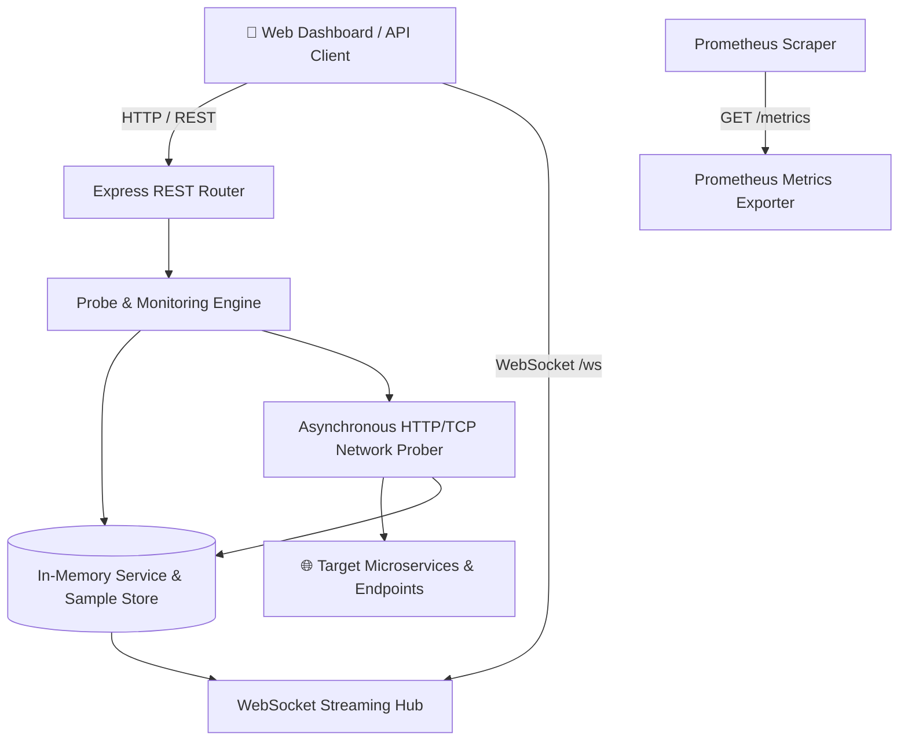

# 📐 System Architecture Document: CloudPulse-API

- **Project:** CloudPulse-API
- **Author:** Expert Software Architect
- **Status:** APPROVED & COMPLETE
- **Version:** 1.0.0

---

## 1. High-Level Architecture Overview



---

## 2. Directory Structure Layout

```text
CloudPulse-API/
├── src/
│   ├── index.js                  # Application entrypoint & HTTP server
│   ├── server.js                 # Express app configuration & middleware
│   ├── probeEngine.js            # Periodic probing loop & network fetcher
│   ├── store.js                  # Thread-safe in-memory store with persistence
│   ├── stats.js                  # Statistical percentile calculations (p50, p95, p99)
│   ├── prometheus.js             # Prometheus metrics formatting
│   └── websocket.js              # WebSocket hub & client connection pool
├── public/                       # Frontend Live Dashboard
│   ├── index.html                # Dark-themed operational UI
│   ├── style.css                 # Responsive CSS3 styles & animations
│   └── app.js                    # WebSocket client & real-time chart renderer
├── tests/                        # Automated Test Suites
│   ├── stats.test.js             # Unit tests for percentile and uptime calculations
│   ├── store.test.js             # Unit tests for service CRUD & history ring buffer
│   └── api.test.js               # Integration tests for REST endpoints & Prometheus
├── artifacts/                    # Engineering Lifecycle Documents
│   ├── RESEARCH_REPORT.md
│   ├── PRD.md
│   ├── ARCHITECTURE.md
│   ├── QA_REPORT.md
│   ├── RELEASE_NOTES.md
│   └── COMMUNICATION_LOG.md
├── Dockerfile                    # Multi-stage production container
├── docker-compose.yml            # Zero-configuration orchestration
├── package.json                  # Dependencies & test scripts
├── .github/workflows/ci.yml      # GitHub Actions automated CI/CD pipeline
└── README.md                     # Comprehensive project documentation
```

---

## 3. Data Model & REST API Contracts

### Data Model: `Service`
```typescript
interface Service {
  id: string;               // Unique alphanumeric ID (e.g. srv-auth-01)
  name: string;             // Human readable name (e.g. Auth Gateway)
  url: string;              // Target HTTP/HTTPS endpoint
  intervalMs: number;       // Polling frequency in ms (default: 10000)
  timeoutMs: number;        // Request timeout in ms (default: 5000)
  status: 'HEALTHY' | 'DEGRADED' | 'DOWN' | 'PENDING';
  lastCheckedAt: string;    // ISO timestamp
  lastLatencyMs: number;    // Most recent round-trip latency
  uptimePercent: number;    // Calculated uptime (e.g. 99.85%)
  stats: {
    p50: number;
    p95: number;
    p99: number;
    sampleCount: number;
  };
  history: Array<{
    timestamp: string;
    status: string;
    statusCode: number;
    latencyMs: number;
  }>;
}
```

### REST API Endpoints
1. `GET /api/health` -> System health (`status: 'OK'`, `uptime: number`, `servicesMonitored: number`)
2. `GET /api/services` -> List all monitored services with current stats
3. `POST /api/services` -> Register a new service (`{ name, url, intervalMs?, timeoutMs? }`)
4. `DELETE /api/services/:id` -> Remove a monitored service
5. `POST /api/services/:id/ping` -> Trigger an immediate ad-hoc probe
6. `GET /metrics` -> Standard Prometheus metrics text
