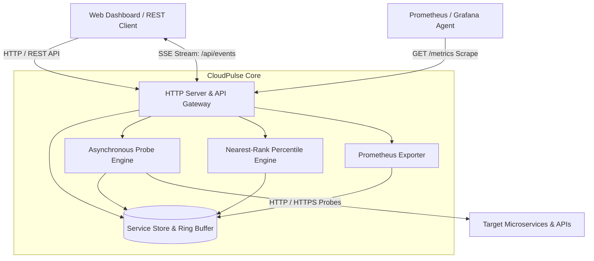
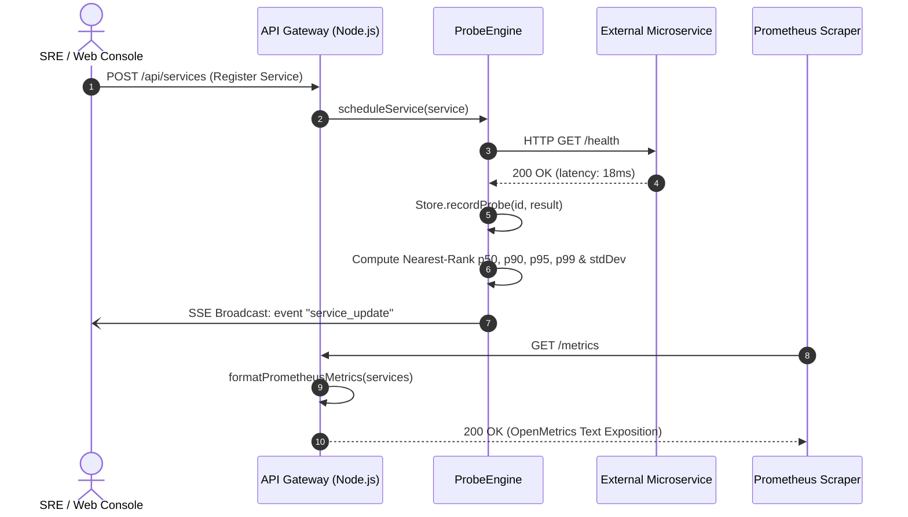

# 🏛️ System Architecture Specification: CloudPulse-API v2.0.0
- **Document Status:** APPROVED & COMPLETE
- **Author:** Principal Systems Architect
- **Version:** 2.0.0
- **Date:** 2026-09-20

---

## 1. Architectural Overview

`CloudPulse-API v2.0.0` provides an asynchronous synthetic probe and Prometheus exposition architecture.



---

## 2. Probe Lifecycle & Telemetry Streaming Sequence



---

## 3. Data Structures

### 3.1 Service Entity Schema
```typescript
interface ServiceEntity {
  id: string;                    // Unique identifier (e.g. srv-a1b2c3d4)
  name: string;                  // Service display name
  url: string;                   // HTTP/HTTPS target URL
  intervalMs: number;            // Polling interval in milliseconds
  timeoutMs: number;             // Request timeout in milliseconds
  status: 'PENDING' | 'HEALTHY' | 'DEGRADED' | 'DOWN';
  lastCheckedAt: string | null;  // ISO 8601 timestamp
  lastLatencyMs: number;         // Most recent probe latency
  uptimePercent: number;         // Cumulative uptime percentage
  stats: ServiceStatistics;      // Statistical distribution metrics
  history: ProbeHistoryEntry[];  // Bounded ring buffer (max 100 entries)
}

interface ServiceStatistics {
  p50: number;                   // Median latency (ms)
  p90: number;                   // 90th percentile latency (ms)
  p95: number;                   // 95th percentile SLA latency (ms)
  p99: number;                   // 99th percentile tail latency (ms)
  avg: number;                   // Arithmetic mean latency (ms)
  min: number;                   // Minimum latency observed (ms)
  max: number;                   // Maximum latency observed (ms)
  stdDev: number;                // Latency standard deviation (ms)
  sampleCount: number;           // Valid sample count
  uptimePercent: number;         // Computed uptime percentage
}
```

---

## 4. REST API Surface

| Method | Endpoint | Description | Status Code |
| :--- | :--- | :--- | :--- |
| `GET` | `/api/health` | System liveness probe | 200 OK |
| `GET` | `/api/stats` | Global health summary (total, healthy, degraded, down) | 200 OK |
| `GET` | `/metrics` | Prometheus standard scrape endpoint | 200 OK (text/plain) |
| `GET` | `/api/services` | List all monitored microservices | 200 OK |
| `POST` | `/api/services` | Register a new microservice for monitoring | 201 Created |
| `DELETE`| `/api/services/:id` | Remove a service from monitoring | 200 OK / 404 |
| `POST` | `/api/services/:id/ping` | Execute an ad-hoc synthetic probe | 200 OK / 404 |
| `GET` | `/api/events` | Real-time Server-Sent Events (SSE) telemetry stream | 200 OK (text/event-stream) |
